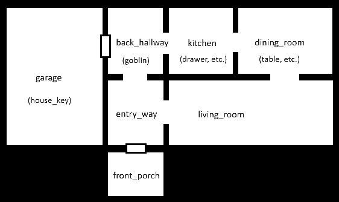

# Getting Started

This document describes how to get started writing your own adventure.

The AdventureScript repo has a `Games` directory with subdirectories for each game.
Each game subdirectory has the following contents:

- Required `adventure.txt` file, which is the game definition file.

- Optional .txt and .md files that may be included by `adventure.txt`.

- Optional image files used by the game.

## Demo Game

This document describes the Demo game, which is in the `Demo` subdirectory under
the `Games` directory. 

The [adventure.txt](../Games/Demo/adventure.txt) file for the Demo game contains
the complete definition with comments. This document provides a longer commentary
of selected elements of the game.

The goal of the Demo game is to get out of a house. However, the front door is locked,
so you need to find the key in the garage. However, to get to the garage you need to
get past a goblin. There are also various items scattered around the house, including
knives which can be used as weapons.

Following is the floor plan used by the game:



## Include Files

The demo game definition file begins by including two files from the AdventureScript
foundation library.

```text
include "../inc/Foundation-Debug.md";
include "../inc/Foundation.md";
include "../inc/Foundation-Combat.md";
```

The library files are in the `inc` subdirectory under `Games`, so the relative path
from the `Demo` directory begins with "../inc".

[Foundation-Debug.md](../Games/inc/Foundation-Debug.md) is an optional module that
degugging commands like "list items". It is useful to include while you are debugging
and testing your game.

[Foundation.md](../Games/inc/Foundation.md) is the core module of the AdventureScript
foundation library. It defines basic concepts like rooms, doors, keys, containers,
lighting, and navigation commands.

[Foundation-Combat.md](../Games/inc/Foundation-Combat.md) is an optiona module that
implements a simple combat system. It defines weapons, armor, and monsters.

## Items and Properties

Items are general-purpose objects in AdventureScript. The player is an item. Rooms
and doors are items, as are keys, weapons, monsters, and anything else the player
might interact with.

An item is created in one of the following ways:

- Using the `item` keyword. This is done at top-level scope, outside of any code
  block. You can then refer to the item by the specified name.
- Using the `NewItem` function. This returns an item object, which you can assign
  to a variable.
- Using any other function that directly or indirectly calls `NewItem`. The Demo
  game calls several such functions: `NewKey`, `NewLockedDoor`, `NewClosedDoor`,
  `NewOpening`, `NewMonster`, etc.

Items have properties that determine how they behave. The foundation library
defines many properties, and you can define your own using the `property` keyword.
For example, `NewLockedDoor` and similar functions set "link" properties to connect
the door object with its associated rooms.

## Creating Rooms

Rooms are items that the player can navigate to. The current room is specified
by the `player` item's `Location` property.

The Demo game creates rooms as follows:

1. Creates rooms using the `item` keyword at global scope.
2. Sets the `Description` property of each room inside a `game` block.
3. Links rooms together with doors and openings.

A `game` block is a block of code that is executed once at the beginning
of the game. There are also `turn` blocks, which are executed each turn.
The following example shows how two rooms in the Demo game are defined.

```text
# Declare room items at top-level scope.
item entry_way;
item back_hallway;

# ... other code ...

game {

    # ... other code ...

    # Set room descriptions inside a game block.
    entry_way.Description = "You are in an entryway.";
    back_hallway.Description = "You are in back hallway.";

    # ... other code ...

    # Link rooms together inside a game block.
    NewOpening(entry_way, back_hallway, Direction.North);
}
```

## Creating Other Items

Apart from rooms and doors, the Demo game creates the following types of items:

- A key created using the `NewKey` function.
- A monster created using the `NewMonster` function.
- A container (kitchen drawer) created using the `NewContainer` function.
- A table created using the `NewTable` function.
- Weapons created using the `NewWeapon` function.
- A miscellaneous item (plate) created using the `NewPortableItem` function.

## EndGame and Delegates

A game is won when `EndGame(true)` is called or lost when `EndGame(false)` is
called. The Demo game is won if the user reaches the front porch. To handle
this case, the Demo game defines a function and assigns it to the `front_porch`
item's `EnterAction` property.

The `EnterAction` property is one of many delegate properties defined by the
AdventureScript Foundation Library. A delegate is a reference to a function.
A _delegate type_ specifies the parameters and return type of a function that
can be assigned to that delegate.

The foundation library uses delegates properties to allow games to add custom
behavior. By convention, many of these properties have names ending in "Action".
When the player navigates from one room to another, the foundation library calls
the `LeaveAction` delegate on the room being left and the `EnterAction` delegate
on the room being entered.

These two properties are defined in the foundation library as follows:

```text
delegate NavigationAction($from:Item, $to:Item) : Bool;
property LeaveAction : NavigationAction;
property EnterAction : NavigationAction;
```

A function assigned to the `EnterAction` property must have the same parameter
types and return type as the `NavigationAction` property. The Demo game
therefore defines the following function:

```text
# Function to be assigned to front_porch.EnterAction.
function OnExitHouse($from:Item, $to:Item) : Bool
{
    Message("Congratulations! You made it out of the house! You win!");
    EndGame(true);
}
```

A function definition must be at global scope. However, the assignment of the
function to the `EnterAction` property is a statement, which must occur inside
of a code block. The Demo game does this inside of a game block so the assignment
occurs once when the game is initialized:

```text
game
{
    # Set the front_porch enter action.
    front_porch.EnterAction = OnExitHouse;

    # ... other game initialization ...
}
```
